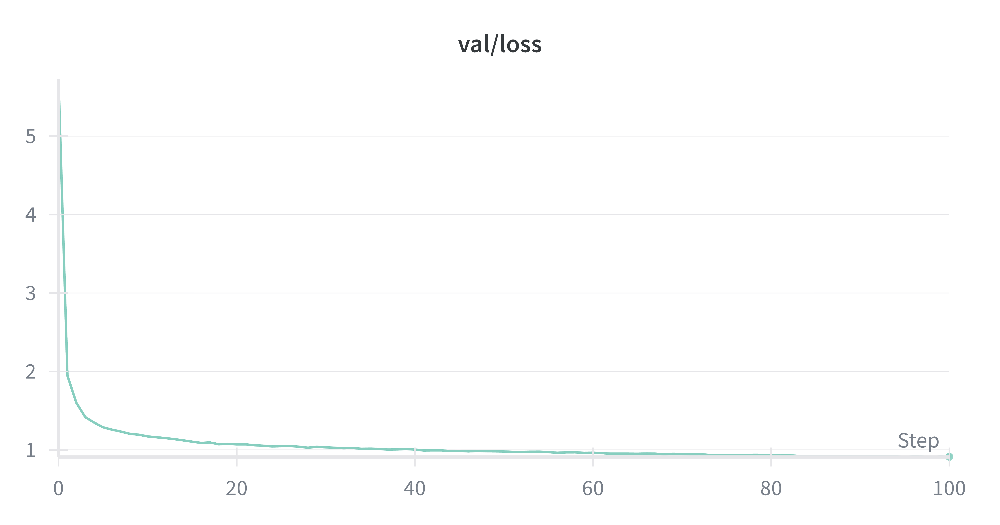

# Project: Spot the Altered Sentence

Goal: given two chunks of English text, decide which one was altered.

## Current Implementation

- **Model**: a decoder-only, byte-level Transformer (~62M params), trained from scratch (nanoGPT). Sanity check for difficulty of task.
- **Training**: causal mask, trained only on **original** sentences.
- **Decision rule**: score each candidate by **summed NLL** under the LM; the one with **lower loss** is treated as the original.
- **Scale**: ~900k pairs (typically 1–2 sentences).
- **Current result**: **81.6%** accuracy.

## How it works

Train a byte LM with BOS/EOS. At eval, split long strings into 128-token windows, sum token NLLs for A and B, pick the smaller sum.

## Todo

- **bidirectional (no causal mask)**  
  Concatenate `A [SEP] B` and train a small cross-encoder with a logistic loss to choose the altered one. Or just use an encoder-style Transformer and classify directly. (removing causal mask)

- **discriminator on top of the LM**  
  Keep the current LM and add a tiny head (e.g., logistic regression or a small MLP) over simple features like `ΔNLL`, length terms, maybe pooled hidden states.

- **test larger vocab**  
  Train a tokenizer (e.g., BPE) and compare against bytes. 

